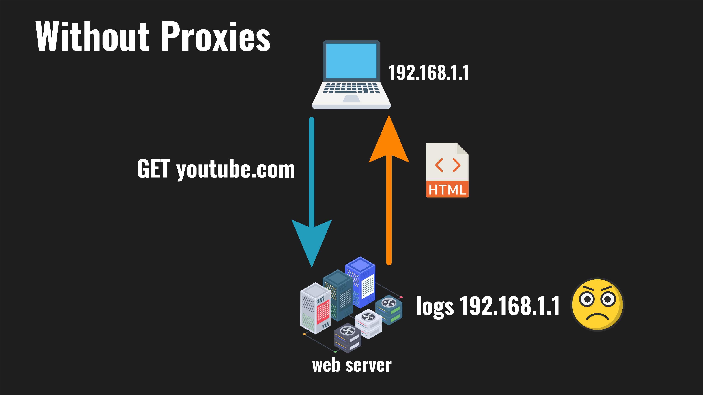
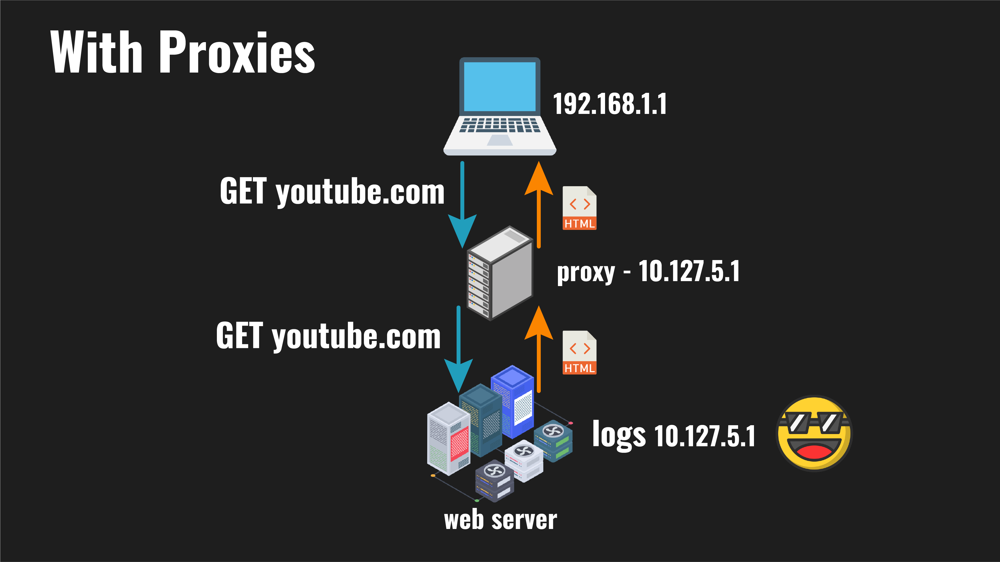
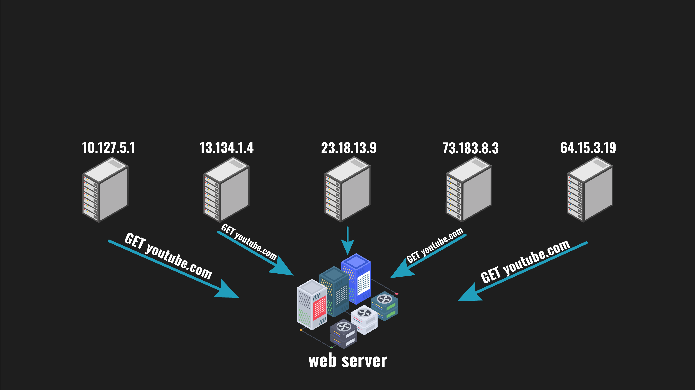
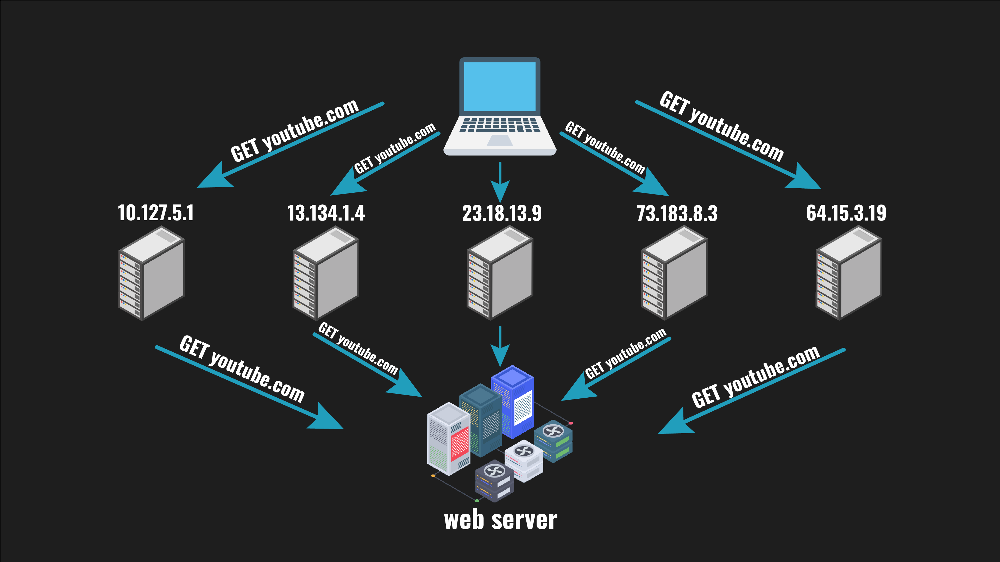
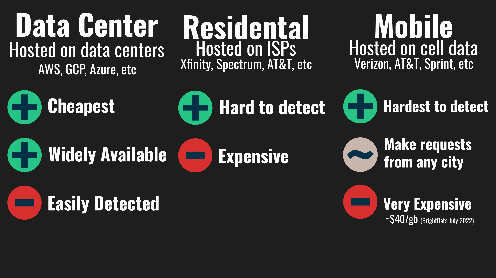
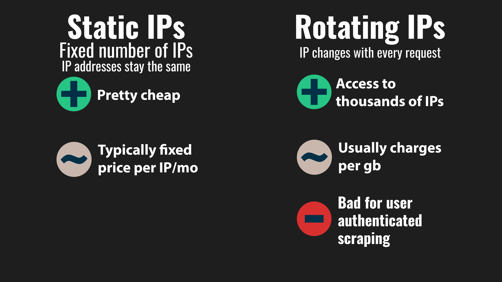
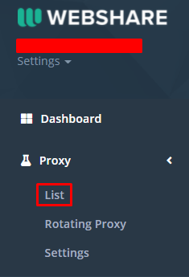
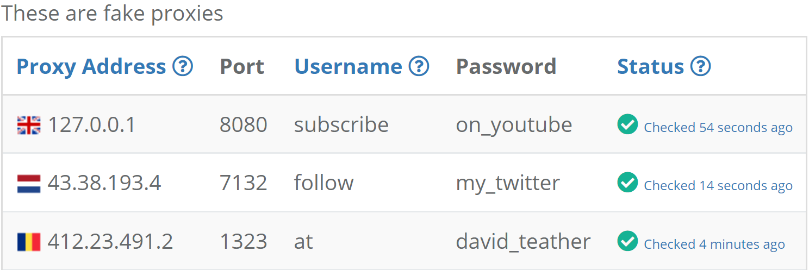
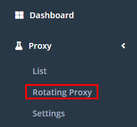
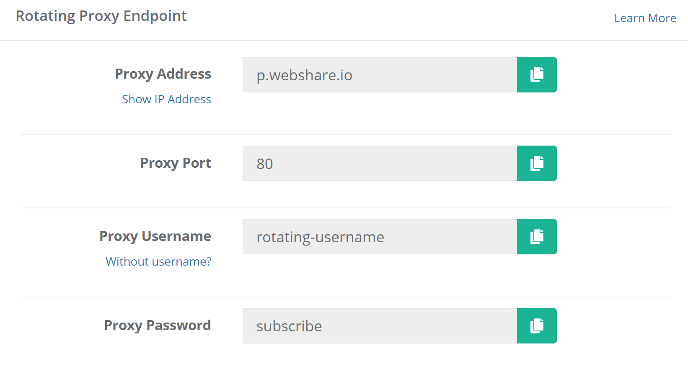

# Lesson 2 - Proxies

This lesson is designed to teach you about what proxies are are, how they're helpful in web scraping, the different kinds of proxies, and how to use them in python!

**Note:** No activity in this lesson, I couldn't figure out a way that was still challenging but actually possible to implement. If you have ideas on how to do this feel free to file an issue or submit a PR :)

### Supporting The Project
* Star the repo 😎
    * Maybe share it with some people new to web-scraping?
* Consider [sponsoring](https://github.com/sponsors/davidteather) me on GitHub
* Send me an email or a [LinkedIn](https://www.linkedin.com/in/davidteather/) message telling me what you enjoy in the course (and maybe what else you want to see in the future)
* Submit PRs for suggestions/issues :)

## Learning Objectives
* Learners will know how proxies work
* Learners will understand how proxies are helpful in web scraping
* Learners will be able to compare the different tradeoffs of the most common proxy types 
* Learners will use proxies in python

## Table of Contents
* [Lesson Video](#lesson-video)
    * [Video Corrections](#video-corrections)
* [What Are Proxies?](#what-are-proxies)
* [Why Use Proxies?](#why-use-proxies)
* [How To Get Proxies](#how-to-get-proxies)
* [The Different Types of Proxies](#the-different-types-of-proxies)
* [What Type Of Proxy Should You Use?](#what-type-of-proxy-should-you-use)
* [How To Use Proxies In Python?](#how-to-use-proxies-in-python)
* [Conclusion](#conclusion)

## Lesson Video

[](https://www.youtube.com/watch?v=X0FG2JaaWOY&list=PLmRtxHvzkEE8Ofiy4hnnXSoxw7gs4HOHt)

[Watch Here](https://www.youtube.com/watch?v=X0FG2JaaWOY&list=PLmRtxHvzkEE8Ofiy4hnnXSoxw7gs4HOHt)

### Video Corrections
None so far

## What Are Proxies?
Note: All of this information is covered with visuals in the video linked in this readme. If you watched the video you're done with the section.

Without using a proxy, requests from your computer go directly to the server hosting the website you’re scraping. The server then has access to your IP making that request, which isn’t always a problem but there’s some techniques to stop web scraping that do use IP detection.

<div align="center">
  
</div>

Proxies are like pass-through computers for accessing the internet, your computer makes a request to a proxy, then that proxy makes the real request to the website returning its information to your computer.

<div align="center">
  
</div>

This way the website only has access to the IP from the proxy (which is easier to switch), not your real IP.

This way of disguising who is making the real request to a website is **critical for web scraping**.

## Why Use Proxies?

Websites typically want to stop web scraping, and implement a rate limit, which is a technique to ensure that a single IP hasn’t made over some number of requests in a given time period, for example 10 requests in a minute.

If an IP has made more than the permitted amount, then no data is returned thus preventing web scraping. This threshold is designed so that normal users of the website won’t ever hit this rate limit, however careless bots trying to extract data will hit this limit.

We can use proxies to circumnavigate this rate limit since the rate limiters are typically tied to a specific IP, we can use proxies to make requests from different IPs. Using a single proxy does not increase your effective rate limit, however if you use a combination of a bunch of different proxies, then the effective rate limit is multiplied by the number of proxies you’re using.

<div align="center">
  
</div>

To this server it looks like there's 5 different clients making requests.

<div align="center">
  
</div>

In reality it's just one computer controlling 5 different proxies.

## How To Get Proxies

There are many sites that offer proxies as a service, although it’s entirely possible to host your own. It’s typically much easier and cheaper to pay a company that specializes in this. 

I've personally used both. I'm not sponsored by either of them while writing this, but I do have affiliate links. Feel free to use them it supports this project 😀
* [Bright Data](https://brightdata.grsm.io/u10xm7thq4ci) (affiliate link)
    * [non-affiliate link](https://brightdata.com/)
* [Webshare.io](https://www.webshare.io/?referral_code=3x5812idzzzp) (affiliate link)
    * [non-affiliate link](https://www.webshare.io/)
    * Has a free tier of up to 1gb/month with 10 proxies
        * I've found this useful for small projects that I don't justify buying proxies for

## The Different Types Of Proxies
Typically companies that offer proxies as a service have various types of different proxies. I've covered the most common types of proxies that I've seen below.

* Data Center
    * Hosted on data centers like AWS, GCP, Azure, etc
    * Advantages
        * Cheapest variant
        * Most accessible 100% of proxy services should have this
    * Disadvantages
        * Easiest proxy to detect as most real end users will not be connecting from a data center
* Residential
    * Tied to physical locations typically from ISPs like Xfinity, Spectrum, AT&T, etc
    * Advantages
        * Hard to detect as most real end-users will be connecting from an ISP
    * Disadvantages
        * Fairly expensive as you're indirectly paying for an internet subscription
* Mobile
    * Use cell providers like Verizon, AT&T, Sprint, etc
    * Advantages
        * The hardest to detect 
        * Companies that offer these typically let you select specific cities to make requests from which can be advantageous depending on your needs
    * Disadvantages
        * Extremely expensive ($40/gb Bright Data July 2022)

<div align="center">
  
</div>

In addition to these different proxy types companies also typically offer two types of proxy pools.
* Static IPs
    * Fixed number of IPs that do not change
    * Advantages
        * Usually pretty cheap
    * Neutral
        * Fixed pricing per IP/month
* Rotating IPs
    * These typically distribute your request across all of the available proxies that proxy provider owns
    * Advantages
        * Potentially access to thousands of IPs
    * Neutral
        * Usually no fixed monthly pricing
    * Disadvantages
        * If you need to log in as a user you'll be making requests from hundreds of IPs which is a huge red flag that you're a bot

<div align="center">
  
</div>

## What Type Of Proxy Should You Use?

The type of proxy you should use is highly dependent on the website you’re trying to scrape, my best advice is to experiment to find the cheapest type that works reliably for you.

There's a lot of changing variables that go into this, a few: websites updating their bot detection, more traffic from your proxy provider to the website from other users, your proxy provider might restrict some websites. For these reasons, I recommend re-evaluating your proxy provider and proxy type if you start having issues.

## How To Use Proxies In Python?
I'll be using [webshare.io](https://www.webshare.io/?referral_code=3x5812idzzzp) (affiliate link) here but other proxy providers have really similar interfaces.

On the side bar if you go to proxy -> list

<div align="center">
  
</div>

Then you should see something that looks like the following

<div align="center">
  
</div>

If we move these credentials into a python script we get something like
```py
PROXY_ADDRESS = "127.0.0.1"
PROXY_PORT = 8080
PROXY_USERNAME = "subscribe"
PROXY_PASS = "on_youtube"
```

I'll be using the requests python package to make HTTP requests. So let's import that
```py
PROXY_ADDRESS = "127.0.0.1"
PROXY_PORT = 8080
PROXY_USERNAME = "subscribe"
PROXY_PASS = "on_youtube"

import requests # run "pip install requests" to install this package
```

Next we can make a dictionary that contains the credentials to our proxy in a URL format.
```py
PROXY_ADDRESS = "127.0.0.1"
PROXY_PORT = 8080
PROXY_USERNAME = "subscribe"
PROXY_PASS = "on_youtube"

import requests # run "pip install requests" to install this package

proxy = {
    "http": f"http://{PROXY_USERNAME}:{PROXY_PASSWORD}@{PROXY_ADDRESS}:{PROXY_PORT}"
    "https": f"http://{PROXY_USERNAME}:{PROXY_PASSWORD}@{PROXY_ADDRESS}:{PROXY_PORT}"
}
```

Finally to make a request with the proxy we can just pass in the proxy dictionary into a requests package method

```py
PROXY_ADDRESS = "127.0.0.1"
PROXY_PORT = 8080
PROXY_USERNAME = "subscribe"
PROXY_PASS = "on_youtube"

import requests # run "pip install requests" to install this package

proxy = {
    "http": f"http://{PROXY_USERNAME}:{PROXY_PASSWORD}@{PROXY_ADDRESS}:{PROXY_PORT}"
    "https": f"http://{PROXY_USERNAME}:{PROXY_PASSWORD}@{PROXY_ADDRESS}:{PROXY_PORT}"
}

requests.get("https://github.com/davidteather/everything-web-scraping/stargazers", proxies=proxy)
# You could also be on the stargazers list if you star this repo 😎
```

You could define multiple proxies and pick which one you wanted to use based on some logic. Maybe you want to randomly select a proxy to send the request through you could define a ton of proxy dictionaries and do something like the following
```py
import random

requests.get("https://github.com/davidteather/everything-web-scraping/stargazers", proxies=random.choice([proxy_1, proxy_2]))
```

It's better to abstract this random proxy usage to either just read in a file that contains all of your proxies, or you could use what's called a **rotating proxy**. [webshare.io](https://www.webshare.io/?referral_code=3x5812idzzzp) (affiliate link) offers a free one that distributes your requests across all of your proxies.

<div align="center">
  
</div>

<div align="center">
  
</div>

<small>Note: fake credentials</small>

If we plug these credentials into the proxy dictionary it'll distribute our requests across all of the proxies that we have on the site.

```py
PROXY_ADDRESS = "p.webshare.io"
PROXY_PORT = 80
PROXY_USERNAME = "rotating-username"
PROXY_PASS = "subscribe"

import requests # run "pip install requests" to install this package

proxy = {
    "http": f"http://{PROXY_USERNAME}:{PROXY_PASSWORD}@{PROXY_ADDRESS}:{PROXY_PORT}"
    "https": f"http://{PROXY_USERNAME}:{PROXY_PASSWORD}@{PROXY_ADDRESS}:{PROXY_PORT}"
}

requests.get("https://github.com/davidteather/everything-web-scraping/stargazers", proxies=proxy)
# You could also be on the stargazers list if you star this repo 😎
```

## Conclusion

Congrats you've finished another lesson :)

If you liked this lesson please consider giving the repository a star and if you have any suggestions I'd love to hear them on [YouTube](https://youtube.com/davidteathercodes), [Twitter](https://twitter.com/david_teather), or file an issue with the label suggestion!