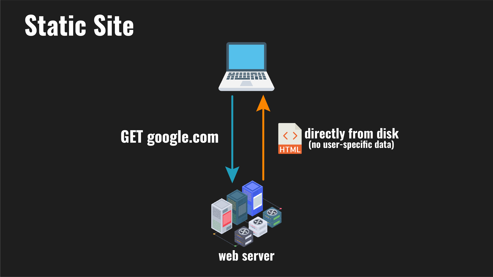
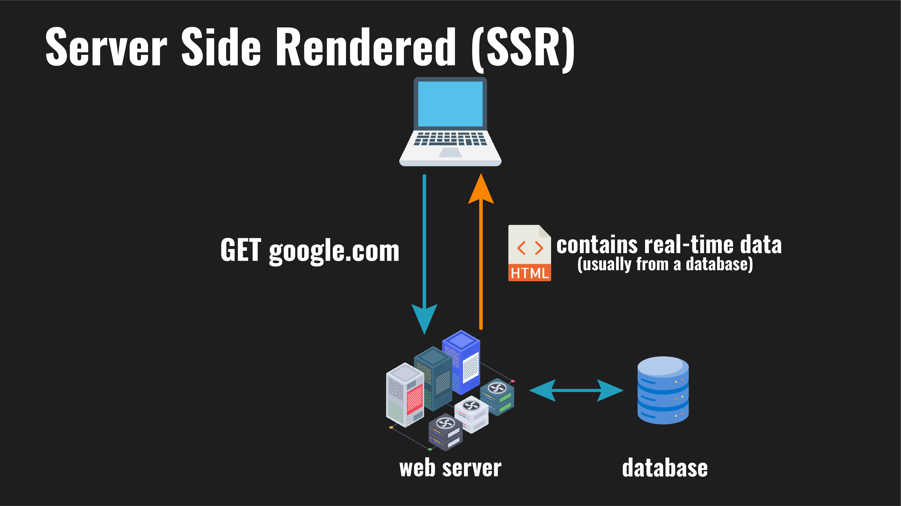

# Lesson 3 - BeautifulSoup With Static Site & Server Side Rendered Web Scraping

This lesson is designed to teach you about how to extract data from static websites and websites that are server side rendered (SSR). We'll be using the python package BeautifulSoup to extract data from the HTML.

### Supporting The Project
* Star the repo 😎
* Share it with someone new to web-scraping
* Consider [sponsoring](https://github.com/sponsors/davidteather) me on GitHub
* Send me an email or a [LinkedIn](https://www.linkedin.com/in/davidteather/) message telling me what you enjoy in the course (and what else you want to see in the future)
* Submit PRs for suggestions/issues :)

## Learning Objectives
* Learners will be able to compare and contrast static sites and server side rendered (SSR) sites, and explain how and why we're able to treat them the same as web scrapers
* Learners will be able to explain basic HTML structure
* Learners will be able to use beautiful soup to extract data from a static site
* Learners will be able to identify if their desired data is statically or dynamically rendered

## Table of Contents

* [Lesson Video](#lesson-video)
* [Static Sites vs Server Side Rendered Sites (SSR)](#static-sites-vs-server-side-rendered-sites-ssr)
    * [Static Sites](#static-sites)
    * [Server Side Rendering (SSR)](#server-side-rendering-ssr)
    * [How We Can Web Scrape These Sites?](#how-we-can-web-scrape-these-sites)
* [Basic HTML Structure](#basic-html-structure)
    * [Tags](#tags)
    * [Attributes](#attributes)
    * [Classes](#classes)
* [Extracting Data Using BeautifulSoup](#extracting-data-using-beautifulsoup)
    * [Running The Website](#running-the-website)
    * [Installing BeautifulSoup](#installing-beautifulsoup)
    * [Getting HTTP From A Website](#getting-http-from-a-website)
    * [Parsing HTML With BeautifulSoup](#parsing-html-with-beautifulsoup)
    * [Extracting Prices From Homepage](#extracting-prices-from-homepage)
        * [Using Developer Tools](#using-developer-tools)
        * [Extracting The First Price](#extracting-the-first-price)
        * [Extracting All Prices](#extracting-all-prices)
        * [Full Code](#full-code)
* [Activities](#activities)


## Lesson Video

[](https://www.youtube.com/watch?v=_Ptvvjm15EA&list=PLmRtxHvzkEE8Ofiy4hnnXSoxw7gs4HOHt&index=4)

[Watch Here](https://www.youtube.com/watch?v=_Ptvvjm15EA&list=PLmRtxHvzkEE8Ofiy4hnnXSoxw7gs4HOHt&index=4)

### Video Corrections
None so far

## Static Sites vs Server Side Rendered Sites (SSR)

### Static Sites

Static websites are just normal HTML files that are served to the user exactly as they're stored on the server, this means user-specific information is not included. Sites that don't require content to change are typically: portfolio websites, blogs, landing pages, documentation, etc. A concrete example is my security blog [The Response Times](https://theresponsetimes.com/) which is fully static.

<div align="center">
  
</div>

> Note: Many websites are static HTML files but use JavaScript to make requests for additional data, this type of site is out of scope for this lesson, but checkout [001 - Introduction To Forging API Requests](../001-introduction-to-forging-api-requests/README.md) to learn more.

> The easiest way to tell if a website is static or not is to view the source code of the website, on most browsers you can right click the page and click "View Page Source". If the data you want is in the source code, then it's statically rendered.

### Server Side Rendering (SSR)

In SSR a server will inject data into HTML before sending it to the client. This is a very widely used approach, but the data injected could be: current trending topics, your messages with another user, or the current weather, and much more.

Since SSR returns HTML that the browser can render without doing extra work, it's popular because it decreases the page load time for the end user especially if they're viewing the website on a computationally weak device.

<div align="center">
  
</div>

### How We Can Web Scrape These Sites?

Since both of these sites return HTML with the data that we want in the file, we just need a way to parse HTML and select the data we want. Luckily, there's tons of python packages that allow us to do this, in this video we'll be using BeautifulSoup.

## Basic HTML Structure

But first, we need to learn the basic syntax and structure of HTML so that we can tell BeautifulSoup how to extract our data.

### Tags

The most important parts of HTML are called tags. Tags build up the structure of the website and each of them has a different purpose and are usually rendered differently by the web browser. All tags start with `<` and end with `>`, an example is the `<p>` opening tag which represents a paragraph of text in HTML.

Tags also must be closed using a closing tag like `</p>`. All content between the opening tag and the closing tag is the content within element.

A completed example
```html
<p>
    Here's my HTML paragraph using the p tag!
</p>
```

An example of how different tags are rendered differently on browsers, is the header tags, they change the font size and range from `<h1>` being the largest to `<h6>` being the smallest.

You can find a list of all supported tags [from Mozilla](https://developer.mozilla.org/en-US/docs/Web/HTML/Element)


Another thing to note is that tags also can be nested
```html
<div>
    <h1>Larger Header Font Size!</h1>
    <p>Paragraph text</p>
</div>
```

### Attributes

The default behavior of tags can be modified by adding attributes to opening tags.

For example the `` tag is used to show an image and has multiple attributes that can be modified. That change how the image is displayed.
```html

```

### Classes

Classes apply user defined style sheets known as CSS that change how an element looks. In well designed websites, this is one of the best ways to select what parts you want to extract data from.

You don't need to know CSS for this tutorial, but here's a basic example.
```html
<p class="green-text">This text is green</p>
<p class="blue-bkg">This background is blue</p>
<p class="green-text blue-bkg">This text is green and background blue</p>

 <!-- This is how you define inline CSS, CSS can also be defined in a separate file -->
<style>
.green-text {
    color: green;
}
.blue-bkg {
    background-color: blue;
}
</style>
```

## Extracting Data Using BeautifulSoup

Enough HTML! Let's start extracting data from a website using BeautifulSoup.

### Running The Website

Visit [Running The Websites](../README.md#how-to-start-the-mock-websites)

### Installing BeautifulSoup

If it's not already installed, run `pip install -r requirements.txt` in this directory. Or do `pip install beautifulsoup4`

### Getting HTTP From A Website

We'll be using the `requests` package to get HTML from the website, you can install it with `pip install requests`

```python
import requests

WEBSITE_URL = "http://localhost:3000"

r = requests.get(WEBSITE_URL)
print(r.text) # print out the HTML
```

### Parsing HTML With BeautifulSoup

Now that we have the HTML in python, we can use BeautifulSoup to parse it.

```python
from bs4 import BeautifulSoup
import requests

WEBSITE_URL = "http://localhost:3000"

r = requests.get(WEBSITE_URL)
soup = BeautifulSoup(r.text, "html.parser") # parse the HTML
print(soup)
```

### Extracting Prices From Homepage

To extract the prices from the homepage, we first have to look at the HTML and figure out how to select the right elements.

I personally prefer to use developer tools, but you can also view the page source directly in the browser, after right clicking the page.

#### Using Developer Tools

* Find the element you want to extract data from
* Right click on the element and click `Inspect`
* Then you can see the price $3.13 is in a `<p>` tag in the browser

*(Step by step in video)*

#### Extracting The First Price

However you choose to view the HTML, you should see something like this
```html
<div class="product-details">
    <h4><a href="">Sacha the Deer</a></h4>
    <div class="product-description">
        <p>Sacha’s elegant antlers have never been se…</p>
    </div>
    <p>$3.13</p>
</div>
```

We see the price is in a `<p>` tag without a class or id, this makes it a little bit more difficult especially since there's multiple `<p>` tags so we need to find a way to select the right one.

To do this, we can first select the parent `<div>` with `class="product-details"`.

```python
soup = BeautifulSoup(r.text, "html.parser")

# select the parent div
product_detail = soup.find("div", {"class": "product-details"}) # you can select by any attribute with this syntax

print(product_detail)
```

Results in
```html
<div class="product-details">
    <h4><a href="">Sacha the Deer</a></h4>
    <div class="product-description">
        <p>Sacha’s elegant antlers have never been se…</p>
    </div>
    <p>$3.13</p>
</div>
```

We need to select the `<p>` tag since that contains the price of the item, it's a child of `product_detail` so we can select it like so.
```python
print(product_detail.p)
```

Which returns
```html
<p>Sacha’s elegant antlers have never been se…</p>
```

But, since there's multiple `<p>` tags that are children of `product_detail`. We need to select the right one. We can select all children of an element with `find_all()` or `findChildren()`
```python
# We can make another find_all attribute to find the children elements of a given object
for child in product_detail.find_all('p'):
    print(child)

# Or we can use findChildren()
# If we want to see it in an array format
children = product_detail.findChildren('p')
print(children)
```

```html
<p>Sacha’s elegant antlers have never been se…</p>
<p>$3.13</p>
[<p>Sacha’s elegant antlers have never been se…</p>, <p>$3.13</p>]
```

Now we can select the price by selecting the second `<p>` tag
```python
children = product_detail.findChildren('p')
price = children[1]
print(price)
```

```html
<p>$3.13</p>
```

Last step is stripping the HTML tags from the price with `get_text()`
```python
price = children[1].get_text()
print(price)
```

```
$3.13
```

We got the first price! 🤠

#### Extracting All Prices

In our previous code we were only getting the first price, but we want to get all the prices. To do this we can use `find_all()` to get all the `<div>` tags with `class="product-details"`.

Then we can use the same code as before to get the price for each product
```python
for product in soup.find_all('div', attrs={'class': 'product-details'}):
    # We know it's the second child we want
    children = product.findChildren('p')

    # Get rid of the HTML tags
    price = children[1].get_text()
    print(price)
```

#### Full Code

```python
from bs4 import BeautifulSoup
import requests

WEBSITE_URL = "http://localhost:3000"

r = requests.get(WEBSITE_URL)
soup = BeautifulSoup(r.text, "html.parser") # parse the HTML

for product in soup.find_all('div', attrs={'class': 'product-details'}):
    # We know it's the second child we want
    children = product.findChildren('p')

    # Get rid of the HTML tags
    price = children[1].get_text()
    print(price)
```

## Activities

Here's some additional activities to help you practice web scraping. After trying for a bit, use the hints to help you out. If you're still stuck, the solutions are in the video!

Modify `activities.py` and complete the functions.

**Do not** change the method names, however feel free to call those methods if you want to test them out in the `if __name__ == "__main__"` section.

### Testing 

To check if your implementations are correct run `python test.py` this will import the functions you made. It will tell you what tests failed if any, and will show a success message if all tests passed. 

> Note: Bonuses are not tested, so you'll have to check those yourself.

### 1: Product Title & Prices
* Return a list of the product titles and prices
    * Ex: `["Sacha the Deer ($3.13)", ...]`
* <details>
    <summary>Hint</summary>
    You'll need to select the parent of all product features which is all of the &lt;li&gt; elements under the &lt;ul class="product-list"&gt; element
  </details>

### 2: Get All Colors Available For Each Product
* Return each product's title and color options as a list of strings
    * Ex: `["Sacha the Deer (#000000, #39589e, #9c5145, #dfd3c2)", ...]`
* <details>
    <summary>Hint: Extracting Attributes</summary>
    You can access attributes of an element with get('attribute_name')

    Ex: `product.find('a').get('href')`
  </details>

### 3: Get Every Product's Material
* This is visible when you click into a product's page
* Return each product's title and material as a list of strings
    * Ex: `["Bumble the Elephant made of 70% Cotton, 30% Nylon", ...]`
* <details>
    <summary>Hint</summary>
    You'll need to make an additional HTML request for each product, and a new BeautifulSoup object for each product page.
  </details>

### 4: Filter all the products from highest reviewed to lowest reviewed
* Return a list of the products sorted by the star count
    ```
    [('Scar the Lion', 5),
    ('Gerald the Giraffe', 4),
    ('Gavin the Tiger', 4),
    ('Sacha the Deer', 3),
    ('Bumble the Elephant', 3),
    ('Todd the Hedgehog', 2)]
    ```

### 5: Product Availability
* Not all products are available, look at `Gerald the Giraffe`
* Return a list of strings of all products and their availability
    * Ex: `["Sacha the Deer is available: True", ...]`
* <details>
    <summary>Bonus</summary>
    Add some logic to check products every X minutes, so you can be notified when products come back in stock.
    
    Note: This website won't have items come back into stock, but if it was a real website you could have a Discord bot or something notify you.
    - Example: Old commisioned project I made [here](https://github.com/davidteather/Hotukdeals-Discord-Notifier)
  </details>

### 6: Scrape Reviews For Each Product
* Return a dictionary with structure `{"product_title": [{"rating": "5", "review_title": "Great!", "review_full": "I love it"}, ...], ...}`
    * Ex: `{"Sacha the Deer": [{'rating': '5', 'review_title': 'V neck', 'review_full': 'Great shirt. love the detail in back. feminine and different than the average t'}]}`
* <details>
    <summary>Bonus</summary>
    Try and do sentiment analysis on product reviews and sort by ones with the best average sentiment.

    You might find [this article](https://realpython.com/python-nltk-sentiment-analysis/#using-nltks-pre-trained-sentiment-analyzer) helpful
  </details>

### Solutions

* [1: Product Title & Prices](https://youtu.be/_Ptvvjm15EA?list=PLmRtxHvzkEE8Ofiy4hnnXSoxw7gs4HOHt&t=506)
* [2: Get All Colors Available For Each Product](https://youtu.be/_Ptvvjm15EA?list=PLmRtxHvzkEE8Ofiy4hnnXSoxw7gs4HOHt&t=547)
* [3: Get Every Product's Material](https://youtu.be/_Ptvvjm15EA?list=PLmRtxHvzkEE8Ofiy4hnnXSoxw7gs4HOHt&t=620)
* [4: Filter all the products from highest reviewed to lowest reviewed](https://youtu.be/_Ptvvjm15EA?list=PLmRtxHvzkEE8Ofiy4hnnXSoxw7gs4HOHt&t=679)
* [5: Product Availability](https://youtu.be/_Ptvvjm15EA?list=PLmRtxHvzkEE8Ofiy4hnnXSoxw7gs4HOHt&t=710)
* [6: Scrape Reviews For Each Product](https://youtu.be/_Ptvvjm15EA?list=PLmRtxHvzkEE8Ofiy4hnnXSoxw7gs4HOHt&t=744)

## Conclusion

Congrats you've finished another lesson :)

If you liked this lesson please consider giving the repository a star and if you have any suggestions I'd love to hear them on [YouTube](https://youtube.com/davidteathercodes), [Twitter](https://twitter.com/david_teather), or file an issue with the label suggestion!