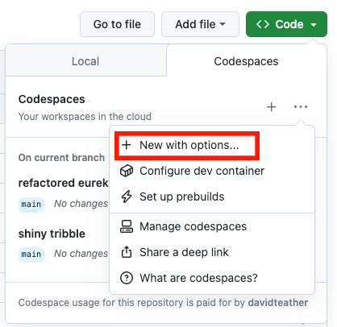
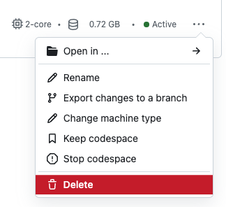

# Everything Web Scraping
Learn everything web scraping by [David Teather](https://twitter.com/david_teather) find the video series on [YouTube](https://youtube.com/playlist?list=PLmRtxHvzkEE8Ofiy4hnnXSoxw7gs4HOHt).

    

## Table Of Contents
1. [Course Catalogue](#course-catalogue)
2. [How To start The Mock Websites](#how-to-start-the-mock-websites)

**Please** consider giving [Course Feedback](https://forms.gle/LjRwHoR34vD1knGa6)

## Welcome!

Glad you're here! If it's your first time check out the the [introduction](./000-introduction/README.md), if not welcome back!

Consider [sponsoring me](https://github.com/sponsors/davidteather) on GitHub to make work like this possible

### Supporting The Project
* Star the repo 😎
    * Maybe share it with some people new to web-scraping?
* Consider [sponsoring](https://github.com/sponsors/davidteather) me on GitHub
* Send me an email or a [LinkedIn](https://www.linkedin.com/in/davidteather/) message telling me what you enjoy in the course (and maybe what else you want to see in the future)
* Submit PRs for suggestions/issues :)
## Course Catalogue
0. [Introduction To The Course](/000-introduction/)
1. [Introduction To Forging API Requests](/001-introduction-to-forging-api-requests/)

## How To Start The Mock Websites

### With GitHub Codespaces (Recommended)

If you don't want to deal with installing and configuring software, I've set up this repository so that a GitHub Codespace can do all of that for you.

> Note: A free GitHub account comes with 60 hours of Codespaces free each month, and if you're a student you can get 90 hours free each month with GitHub Pro through the [GitHub Student Developer Pack](https://education.github.com/pack) ([source](https://github.com/features/codespaces))

#### Creating A Codespace

  
  
Select Code -> Codespaces Tab -> The + Icon -> New With Options

  
Or click <a href="https://github.com/codespaces/new?hide_repo_select=true&ref=main&repo=579266275">here</a>

  
  
Select the configuration of the lesson you're on

#### Cleaning Up

After finishing each lesson you can visit the [GitHub Codespaces](https://github.com/codespaces) menu and delete the Codespace so you don't get charged while you're not using it.

  
  
Delete a Codespace with the 3 dots -> Delete

  
This will delete any changes you've made

> Note: If you enjoy GitHub Codespaces consider checking out my ~30 minute [LinkedIn Learning Course](https://www.linkedin.com/learning/github-codespaces-for-students/why-use-github-codespaces) on Codespaces, you can get free 24h access through [my LinkedIn post](https://www.linkedin.com/feed/update/urn:li:activity:7069391759281147905/) and feel free to send a connection request while you're over there 🤠

### With Docker

Run `docker-compose up` while in a lesson directory, when it says development server started open `localhost:3000` in your browser to check that it's working properly.

When done with this lesson you can `control + c` to shut down your docker containers.

#### Cleaning Up
##### With Docker Desktop

1. Navigate to the containers tab on the side, find the lesson you want to delete and click the trashcan icon to remove it.
2. Navigate to the images tab on the side, find the images starting with the course name to delete and hit the trash can.

##### With Command line

1. To remove containers, `docker rm $(docker ps -a -q --filter name=XXX)`, where XXX is the lesson number you want removed (ex: 001).
2. To remove images, `docker rmi $(docker images --filter label=lesson.number=X -a -q)`, where X is the number you want removed (ex: 1, ex: 10)
